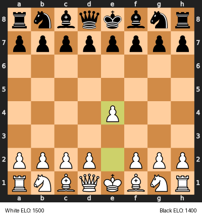
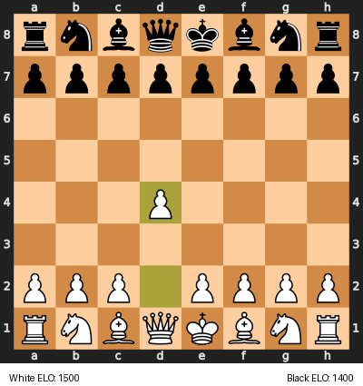

# llmchess

LLM-based chess bot. Just for fun, because why not.


 


### Data

Training data can be downloaded from the [lichess database](https://database.lichess.org/) and put into the `data/` folder.

```
uv run python3 -m llmchess.preprocess_data data/lichess_db_standard_rated.pgn data/train_data.json
```

### Training

```
uv run python3 -m llmchess.train
```